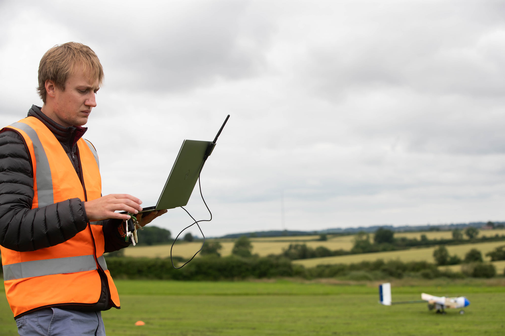
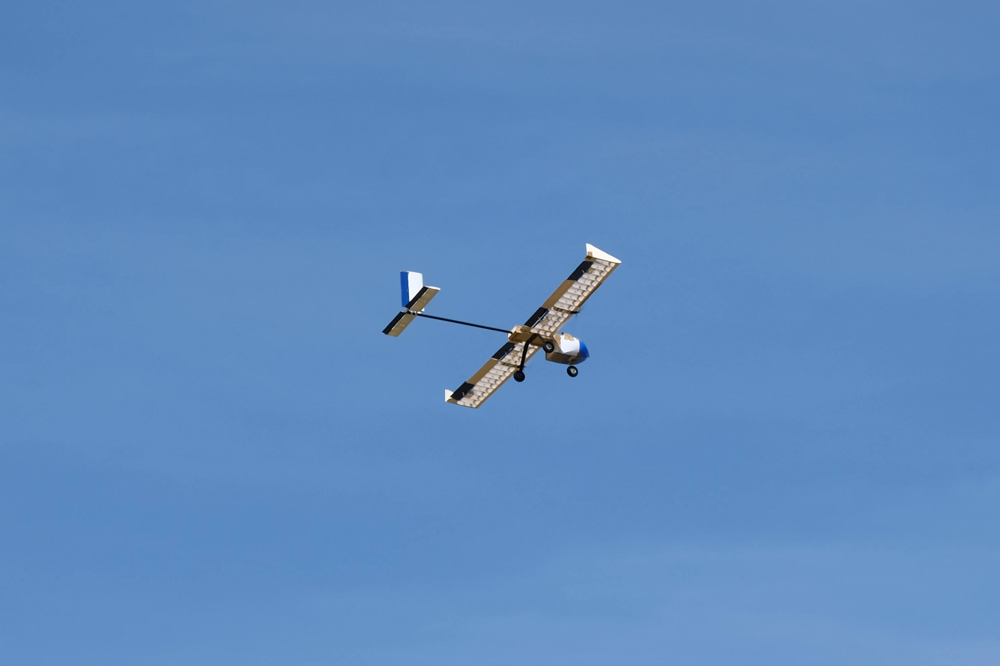

# Nyx, UAS Surrey Team Peryton 2021-22

We won the IMechE UAS challenge 2021. **Nyx is a program dedicated to co-ordinating the whole mission and the image recognition**



Although only partially tested and unfinished - Nyx aimed to control the autopilot to enable more accurate payload drops, switch mission tasks based on various critera, and co-ordinate the glide section of the mission. Nyx aimed to make each launch more repeatable by managing parameters and doing safety checks. Our image recognition was also fairly good - the OCR needed some TLC though.



This code will never work in this form again - but it may be interesting to read through.

See nyx/main.py for the entry point into the program. I'm also trying to document module files within nyx/README.md

to run:
```bash
python -m nyx
```

I've tried to write some useful things below, I'd read them, it may save you some pain.


## -1. Contributing

If you want to change code, make another branch and create a merge request so I can review the changes. Don't push to the master.

Code contributions should start with a current issue or raising a new issue

if none of that makes sense have a read -> https://guides.github.com/


## 0. Aim of the program

if code does something that doesn't contribute to the following, then it is useless. These objectives could be revised if needed though.

1. Run Image Recognition
    - a) Segment an image to find a target
    - b) Retrieve Colour, Charachter and GPS position from target

2. Co-ordinate the flight computer
    - a) Switch from gliding mode / powered mode
    - b) Start/Stop image recognition when required
    - c) Enable mission split?
    - d) increase payload drop accuracy
    - e) Reduce human error in operation (check parameters and list physical checks)
    - f) End mission based on time & battery
    - g) Dynamic glide landing approach based on wind?

3. Clean Code
    a) Split work stages into functions or files
    b) Use type hints for function parameters and return values
    c) Use doc strings for every function even if it seems obvious
    d) All components (files) should have automatic tests


## 1. tools & workflow

Instructions are a mixure of Windows / Linux, for the most part everything works on both.

Python 3.9 can be downloaded from https://www.python.org

Virtual envornments are useful. Read about them here https://docs.python.org/3/tutorial/venv.html

```
python -m venv .venv
.venv/Scripts/activate
```

SFTP -> https://sourceforge.net/projects/winscp/ - load files to and from a remote computer over SSH

Ardupilot SITL -> https://ardupilot.org/dev/docs/setting-up-sitl-on-linux.html

MAVproxy, basic mavlink interface https://ardupilot.org/mavproxy/docs/getting_started/download_and_installation.html#linux

software for gimbal -> https://www.basecamelectronics.com/downloads/8bit/ use version 2.2b2

GLaDOS voice -> https://glados.c-net.org/ 

useful USB commands
```
dmesg | grep tty # list devices
ls -al /dev/serial/by-id # list USB serial devices (pixhawk...)
sudo dmesg | more # history of devices mounted etc
```

this command was useful first time setting up the camera:
```
v4l2-ctl --device /dev/video0 --list-formats-ext
```

serial ports are root by default use 
```
sudo usermod -a -G tty <user>
```

forwarding ports over SSH for jupyter notebook -> https://ljvmiranda921.github.io/notebook/2018/01/31/running-a-jupyter-notebook/
```
localuser@localhost: ssh -N -f -L localhost:YYYY:localhost:XXXX remoteuser@remotehost
```


## 2. installing/compiling

Install OpenCV on raspberry pi -> https://qengineering.eu/install-opencv-4.4-on-raspberry-pi-4.html

Overclocking rpi4 -> https://magpi.raspberrypi.org/articles/how-to-overclock-raspberry-pi-4

Install OpenCV with GPU support on Jetson Nano -> https://qengineering.eu/install-opencv-4.5-on-jetson-nano.html

Install pytorch on the Nano -> https://forums.developer.nvidia.com/t/pytorch-for-jetson-version-1-7-0-now-available/72048

## 3. technical reference

EKF
- https://ardupilot.org/dev/docs/ekf2-estimation-system.html
- https://github.com/ArduPilot/ardupilot/blob/master/libraries/AP_NavEKF2/AP_NavEKF2.cpp


## 4. other downloads

The dataset can be found on the peryton teams.
The raw source for this dataset is found at https://www.sensefly.com/education/datasets/?dataset=1502


## 5. Ardupilot specific

cannot set these parameters in config files
"MIS_TOTAL"
"STAT_RESET"
"STAT_RUNTIME"

## 6. take a deep breath

Drink a beer and prepare for flying bugs
